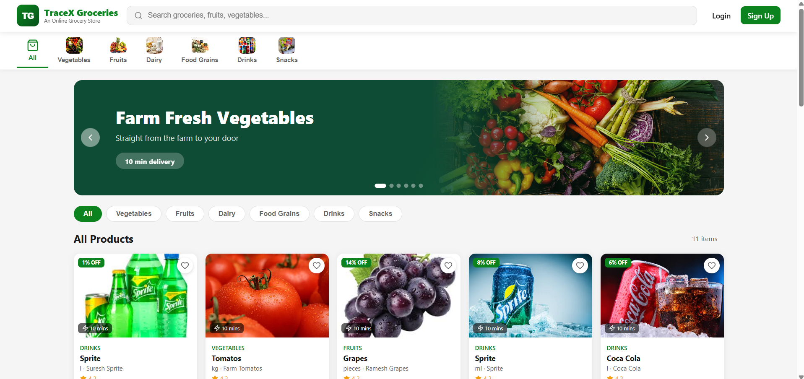
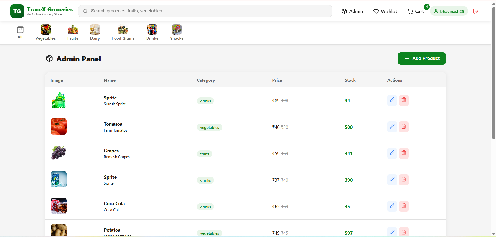
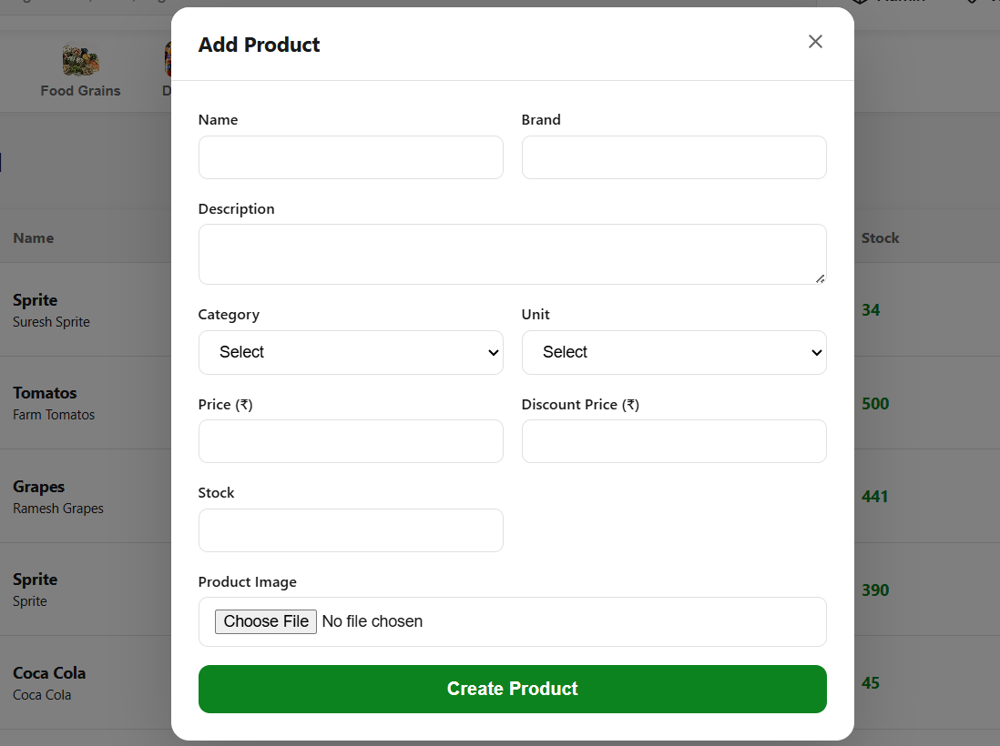
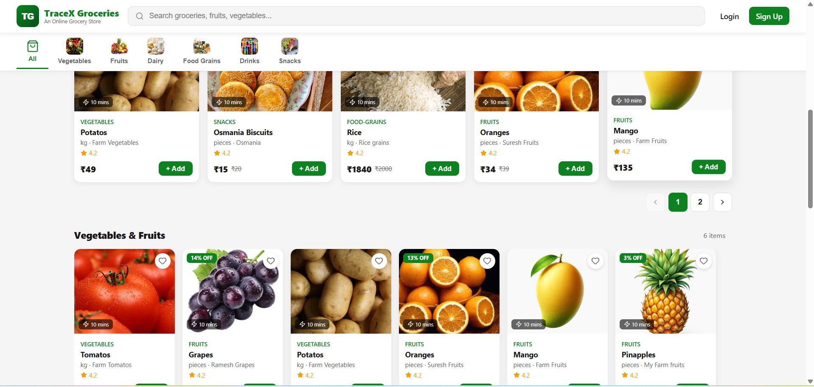
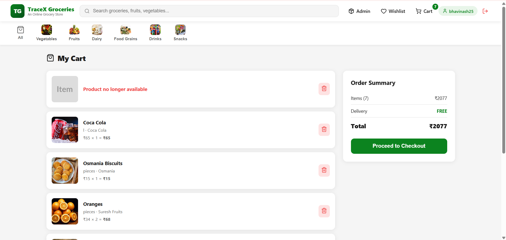
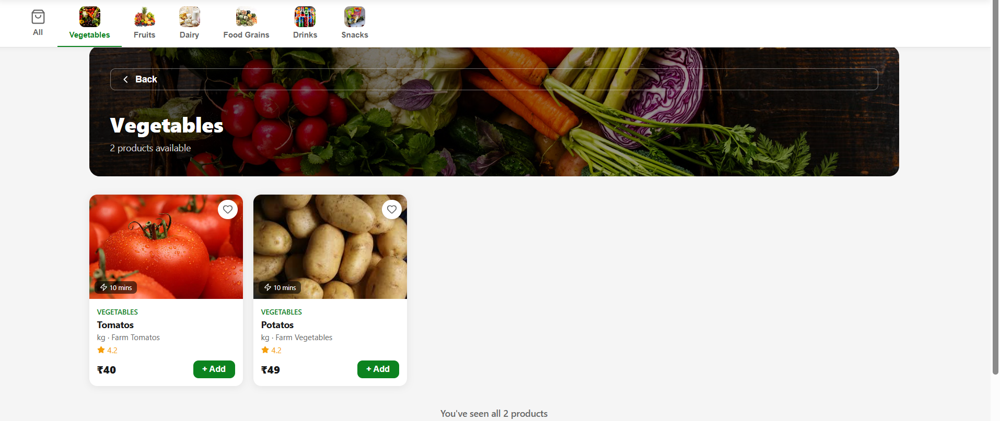

# Online Grocery Store Management
A Mern Stack Project for grocery inventory management

##  Application Screenshots

###  Home Page
Browse featured products and categories from the main landing page.

  

###  Admin Panel
Manage products, categories, and application data through the admin dashboard.

  

###  Product Creation
Create and manage new products using the product creation form.

  

###  Products List
View and manage all available products in the system.

  

###  Shopping Cart
Review selected items and proceed with the checkout process.

  

###  Category Products
Browse products filtered by category for a streamlined shopping experience.

  

## Features
- JWT Authentication
- OTP Verification
- CRUD Operations
- Image Storing
- MongoDB Database
- Admin/User Access
- Secure Backend
- Interactive UI

## Tech Stack
##### Frontend
- React.js
- Javascript
- CSS

##### Backend
- Node.js
- Express.js
- MongoDB
- Image Kit
- Node Mailer

## Project Usage
- Install Required Dependencies mentioned in topics.txt file in backend and as well as in frontend
- Create a .env file in backend and use the env.example.txt file to set values
- Set up the folders and set the frontend and backend hosting values correct
- Run both backend and frontend to visit the project

## Project Description
A grocery ordering system, which allows users to browse grocery items, add products to a cart, place orders online. 
It helps customers purchase groceries easily from anywhere while enabling store owners to manage inventory, orders, customers.
